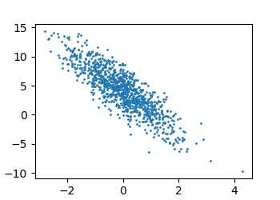

# 第一章 引言

## [PASS]1.1 日常生活中的机器学习


## 1.2 机器学习中的关键组件

### 1.每个数据集由一个个样本组成，且大多数时候遵守独立同分布。样本也可称之为数据点(data point)或数据实例(data instance)，通常每个样本由一组称为特征(feature)或协变量(covariate)的属性组成。要预测的属性被称之为标签(lable)或目标(target)

* 独立（Independent）： 如果随机变量 $X_1$ 、 $X_2$ 、 …… 、$X_n$ 是相互独立的，那么它们的联合概率分布可以拆分为各个随机变量的边际概率分布的乘积。换句话说，一个事件的发生不受其他事件的影响。
* 同分布（Identically Distributed）： 如果随机变量  $X_1$ 、 $X_2$ 、 …… 、$X_n$  具有相同的概率分布，即它们有相同的概率密度函数（对于连续型随机变量）或概率质量函数（对于离散型随机变量），那么它们是同分布的。

### 2.处理图像数据时，每张单独的照片即为一个样本，它的特征由每个像素数值的有序列表表示。

* 如200x200的彩色照片由200x200x3个数值组成，其中3表示每个空间位置的R、G、B通道的强度

### 3.维数(Dimensionality) : 当每个样本的特征类别数量都相同时，其特征向量是固定长度的，这个长度即为维数

### 4.目标函数(Objective Function) : 定义对模型的优劣程度的度量，且这个度量在大多数情况下是可以优化的

* 当目标函数优化到最小值时，即最好时，则称为损失函数(Loss Function)
    * 预测数值时，常见的损失函数有平方误差(Squared Error)，即预测值与实际值的平方
    * 解决分类问题时，常见的损失函数有最小化错误率，即预测与实际情况不符的样本比率

### 5.数据集分两种，训练用的是训练数据集(Training Dataset)，测试用的是测试数据集(Testing Dataset)

### 6.在深度学习中，经常使用梯度下降(Gradient Descent)来搜索出最佳参数，以最小化损失函数


## 1.3 各种机器学习问题

### 1.特征-标签对称为一个样本。若标签未知，则特征也可以被称作为样本

* woda如预测心脏病患者是否会发作时，输入特征可能是生命体征，而标签则是心脏病发作或心脏病没有发作

### 2.监督学习(Supervised Learning)：擅长在已有输入特征的情况下预测标签。监督学习的过程一般分为三步：①从大量数据样本中随机选取一个子集，并为每个样本获取标签，此时这个拥有特征-标签对的子集称之为训练数据集；②将训练数据集输入到有监督的学习算法，并得到一个已完成学习的模型；③将之前没有使用过的特征样本输入到这个模型里，得到预测

* 回归(Regression)问题：是监督学习的任务，有关"是多少、有多少"的问题可能是回归问题。如预测房价、预测气温等等。回归是训练一个回归函数来输出一个数值

* 分类(Classification)问题：则希望模型可以预测样本属于哪个类别。如手写数字可能有10类，标签被设置为0~9。分类是训练一个分类器来输出预测的类别

    * 若分类问题只有两类，如将图片分为{猫，狗}，则被称之为二项分类(Binomial Classification)

    * 若分类问题大于两类，如手写数字识别，则称之为多项分类(Multiclass Classification)

    * 分类问题常见的损失函数为交叉熵(Cross-Entropy)

    * 层次分类(Hierarchical Classification)假定在许多类别之间存在某种关系，可以让一些分类任务的变体寻找层次结果

* 标注问题：用于对输入特征进行打标签，比如一篇文章他可以拥有"机器学习"、"云计算"等多个标签。学习预测不互相排斥的类别也可以被称之为多标签分类(Multi-label Classification)

* 搜索问题：在信息检索领域，我希望对一组结果集进行排序，相关性强的排在前面
    * 与搜索和排序相关的问题是推荐系统(Recommender System)，它的目的是向特定的用户提供个性化推荐

* 序列学习：在连续且具有关联性的输入中，以上的几个问题模型都不能很好地处理输入之间的关联性。如对于一句话的机器翻译，需要清楚不同单词之间的关系。序列学习需要摄取输入序列或预测输出序列，且序列都为可变长度。以下的几种序列转换较为常见：

    * 标记与解析：用属性注释文本序列

    * 自动语音识别

    * 文本到语音

    * 机器翻译

### 3.无监督学习(Unsupervised Learning)：没有十分明确的目标，需要模型自发地学习。如拥有一堆数据，使用它们做一系列科学研究，且对结果没有要求。这类数据中不含有目标的机器学习问题称之为无监督学习

* 聚类(Clustering)问题：在没有标签的情况下，对数据进行分类
* 主成分分析(Principal Component Analysis)问题：能否找到少量的参数来准确地捕捉数据的线性相关属性。如一个球的运动轨迹可以用球的速度、质量和直径来描述
* 因果关系(Causality)和概率图模型(Probabilistic Graphical Model)问题：能否描述观测到的许多数据的根本原因。如，我们能否简单地根据经验数据法线房价、污染和犯罪的统计数据之间的关系
* 生成对抗网络(Generative Adversarial Networks)：提供一种合成数据的方法

### 4.离线学习(Offline Learning)：在算法与环境断开后进行的学习。

* 优点：可以孤立地进行模式识别，而不必分心于其他问题
* 缺点：能解决的问题有限，且不能够和真实环境进行交互

### 5.强化学习(Reinforecement Learning)：机器学习将与环境进行交互。智能体(Agent)在一系列的时间步骤上与环境交互，从环境中接受一些观测(Observation)，并且必须选择一个动作(Action)，然后通过某种机制将其传输回环境，最后智能体在环境中获得奖励(Reward)

* 强化学习的目标是获得一个好的策略(Policy)
* 智能体的动作会产生奖励，但并不会得知是哪个动作产生的。一般奖励只会在一次循环结束后获得，如国际象棋，若智能体获得胜利，则可以获得奖励1，若失败，则得到奖励-1。因此，学分分配(Credit Assignment)问题至关重要，用于处理哪些动作值得获得奖励
* 强化学习可能需要处理部分可观测性问题。例如，清洁机器人需要在进入一座用于许多相同壁柜的房子前考虑其观测结果，以免滚在房子里
* 当环境可被完全观测到时，强化学习问题则被称为马尔可夫决策过程(Markov Decision Process)
* 当状态不依赖于之前的动作时，称该问题为上下问老虎机(Contextual Bandit Problem)
* 当没有状态，只有一组最初未知奖励的可用动作时，称该问题为多臂老虎机(Multi-armed Bandit Problem)


## 1.4 起源

### 1.神经网络有以下关键原则：

* 层(Layer)：线性和非线性处理单元的交替
* 使用链式规则(反向传播)一次性调整网络中的所有参数


## [PASS]1.5 深度学习的发展

pass


## [PASS]1.6 深度学习的成功案例

pass


## 1.7 特点

### 1.机器学习使用数据来学习输入和输出之间的转换，而深度学习是深度的，模型学习之间多了许多"层"之间的转换。如靠近输入的层可以表示数据的低层细节；而接近输出的层可以表示用于区分的更抽象的概念

### 2.表示学习(Representation Learning)的目的是寻找表示本身，因此深度学习可以被称之为“多层表示学习”


# 第二章 预备知识


## 2.1 数据操作

### 1.张量(Tensor)：一个n维数组，或者说n阶数组、具有n个轴的数组

* 在深度框架中，MXNet称其为ndarray，Pytorch和Tensorflow称其为Tensor
* Pytorch的Tensor与Numpy的ndarray相似，但Pytorch的Tensor支持GPU加速运算，且支持自动微分
* 在Pytorch中，如果使用Conda构建环境，那么下载的是pytorch，但在导入包时，应当使用 import torch

### 2.张量表示一个由数值组成的数组，其可能有多个维度。其中，数值被称之为元素(element)

* 具有一个维度/轴：其对应数学上的向量(Vector)
* 具有两个维度/轴：其对应数学上的矩阵(Matrix)


### 3.torch.arrange(n) : 来创建一个行向量，这个行向量包含以0开始的前n个整数。默认创建整数，可以指定为浮点数。默认使用CPU运算

```python
# PROGRAM
x = torch.arange(10)
print(x)

# RESULT
tensor([ 0,  1,  2,  3,  4,  5,  6,  7,  8,  9])
```


### 4.shape属性：访问张量的形状，即沿每个轴的长度

```python
# PROGRAM
x = torch.arange(10)
print(x.shape)

# RESULT
torch.Size([10])
```


### 5.numel()：张量元素的总数(大小Size)，即shape属性中的所有元素的乘积。在向量中，shape和size大小相同

```python
# PROGRAM
x = torch.arange(10)
print(x.numel())

# RESULT
10
```


### 6.reshape()：改变一个张量的形状而不改变元素数量和元素值。如将张量x从行向量转为矩阵[2,5]

* 注意，转换后的矩阵需要充满元素，也就是说原本的张量元素大小Size要满足矩阵的行列乘积
* 若只需要满足特定的行、列，则另一个元素可以以 -1 来表示自动计算

```python
# PROGRAM
x = torch.arange(10)
print(x.reshape(2,5))  # 两行五列
print(x.reshape(-1,5))  # 与上一条语句效果相同

# RESULT
tensor([[0, 1, 2, 3, 4],
        [5, 6, 7, 8, 9]])

tensor([[0, 1, 2, 3, 4],
        [5, 6, 7, 8, 9]])
```


### 7.创建全0、全1、随机张量、自定义张量

* torch.zeros(...)：创建一个指定维度大小的全0张量
* torch.ones(...) : 创建一个指定维度大小的全1张量
* torch.randn(...)：创建一个指定维度大小的服从N(0,1)的标准正态分布随机采样的张量
* torch.tensor(...)：将列表转换为Tensor，外层列表对应轴0，往内递增

```python
# PROGRAM
print(torch.zeros(2,4))
print(torch.ones(2,4))
print(torch.randn(2,4))
print(torch.tensor([[1,2,3,4],[5,6,7,8]]))

# RESULT
tensor([[0., 0., 0., 0.],
        [0., 0., 0., 0.]])

tensor([[1., 1., 1., 1.],
        [1., 1., 1., 1.]])

tensor([[-0.7154, -1.6498,  0.1907,  0.2501],
        [-2.0065, -0.2564, -0.0946,  0.3974]])

tensor([[1, 2, 3, 4],
        [5, 6, 7, 8]])
```


### 8.运算符

* 按元素运算：使用一元运算符对两个张量进行运算

    ```python
    # PROGRAM
    a = torch.tensor([1,1,1,1])
    b = torch.tensor([2,2,2,2])
    
    print(a+b)
    print(a-b)
    print(a*b)
    print(a/b)
    print(a**b)
    
    # RESULT
    tensor([3, 3, 3, 3])
    tensor([-1, -1, -1, -1])
    tensor([2, 2, 2, 2])
    tensor([0.5000, 0.5000, 0.5000, 0.5000])
    tensor([1, 1, 1, 1])
    ```

    

* 张量连接：通过torch.cat( (TensorA,TensorB) , dim=n )将张量A和B在维度/轴n进行连接。如，当dim=0时，则表示在 外层列表 进行连接，即行连接(在二维张量)；当dim=1时，则表示在 由外到内的第二层列表 进行连接，即列连接(在二维张量)

    ```python
    # PROGRAM
    A = torch.tensor([[1,2,3,4,5],[6,7,8,9,10]])
    B = torch.tensor([[11,12,13,14,15],[16,17,18,19,20]])
    
    print(torch.cat((A,B),dim=0))
    print(torch.cat((A,B),dim=1))
    
    # RESULT
    tensor([[ 1,  2,  3,  4,  5],
            [ 6,  7,  8,  9, 10],
            [11, 12, 13, 14, 15],
            [16, 17, 18, 19, 20]])
    
    tensor([[ 1,  2,  3,  4,  5, 11, 12, 13, 14, 15],
            [ 6,  7,  8,  9, 10, 16, 17, 18, 19, 20]])
    ```


* 逻辑运算符，对同大小的张量进行 == 判断，并且构建一个大小相同的新张量，里面的值为True/False

    ```python
    # PROGRAM
    A = torch.tensor([[1,1,1,2],[2,1,2,1]])
    B = torch.tensor([[1,2,2,2],[1,2,1,2]])
    
    print(A==B)
    
    # RESULT
    tensor([[ True, False, False,  True],
            [False, False, False, False]])
    ```


### 9.广播机制(Broadcasting Mechanism)：在形状不同的张量上进行元素运算。工作机制：

* 通过适当复制元素来拓展一个或两个数组，在转换之后，两个张量拥有相同的形状
* 执行按元素操作
* 拓展原理：若A为3行1列，而B为1行2列，无论是A+B还是B+A，都会将矩阵拓展为3x2的矩阵
    * 对于行少的，会将整行复制n次，填充列
    * 对于列少的，会将列内元素复制n次，填充行
* 要求：需要保证其可复制性，如对于3x2和2x4的张量，由于行和列均大于1，无法一起复制，因此无法广播。可以理解为，只有行和列其中一个为1，才具备广播性，如12x1与1x24

```python
# PROGRAM
A = torch.tensor([[1],
                  [2],
                  [3]])  # 3行1列
B = torch.tensor([[1,2]])  # 1行2列

print(A+B)

# RESULT
tensor([[2, 3],
        [3, 4],
        [4, 5]])

# WHY
A -> [ [1,1],[2,2],[3,3] ]
B -> [ [1,2],[1,2],[1,2] ]

```


### 10.索引和切片：与Python的数组一样，可以取值，也可以用于重新赋值

* [0]表示第一个元素，[-1]表示最后一个
* [1,3]表示选取二维张量第二行第四个元素
* [1:5]表示选取第2到5个元素
* [0:2, 2:4]表示选取dim=0的第1行到第2行，用逗号相隔后的第二个冒号表示选择dim=1的第3列到第4列的所有元素

```python
# PROGRAM
A = torch.tensor([ [1,2,3,4,5],[6,7,8,9,10],[11,12,13,14,15] ])

print(A[-1])
print(A[1,3])
print(A[1:5])
print(A[0:2,2:4])

# RESULT
tensor([11, 12, 13, 14, 15])
tensor(9)
tensor([[ 6,  7,  8,  9, 10],
        [11, 12, 13, 14, 15]])
tensor([[3, 4],
        [8, 9]])
```


### 11.内存分配：对于A、B两个张量，若使用A=A+B，则会取消引用Y原本的那片内存空间，并申请了一片新的内存空间来存放X+Y的值并被Y引用。此举可能会造成内存浪费

* 可以使用[:]来进行原地运算，如A[:]=A+B
* 可以使用+=来进行原地运算，如A+=B

```python
# PROGRAM
A = torch.tensor([[1,1,1],[1,1,1]])
B = torch.tensor([[2,2,2],[2,2,2]])

before_id = id(A)
A += B
A[:]=A+B
new_id = id(A)

print(before_id == new_id)

# RESULT
True
```


### 12.Pytorch的张量与Python类型相互转换

* numpy()：转换为Numpy的ndarray
* torch.tensor()：转换为Pytorch的tensor
* item()：转为python的基本类型，也可用int(),float()。只可对大小为1的张量使用

```
# PROGRAM
X = torch.tensor([1])
A = X.numpy()
B = torch.tensor(A)
C = X.item()

print(type(A))
print(type(B))
print(type(C))

# RESULT
<class 'numpy.ndarray'>
<class 'torch.Tensor'>
<class 'int'>
```


## 2.2 数据预处理

### 1.使用pandas包中的read_csv()读取数据集.csv文件

* 若csv原本为空，则写入csv时，第一行为标题
* 在写入文件时，NA表示空，会在输出时显示NaN
* 用\n表示换行

```python
# PROGRAM
os.makedirs('./datas/testdatas', exist_ok=True)
path = os.path.join('./datas/testdatas', 'test.csv')

with open(path, 'w') as f:
	f.write('Tittle,A,B\n')
	f.write('1,2,3\n')
	f.write('4,NA,6\n')

data = pandas.read_csv(path)
print(data)

# RESULT
   Tittle    A  B
0       1  2.0  3
1       4  NaN  6
```


### 2.处理缺失值NaN

* 插值法，用一个替代值弥补缺失值

    * DataFrame.iloc[row_index,column_index]：通过指定行和列的整数位置访问Dataframe类型的元素。注意，索引忽略标题和行序号
    * DataFrame.fillna(value=None, method=None, inplace=False, limit=None)：用于填充数据框（DataFrame）或序列（Series）中的缺失值（NaN）
    * DataFrame.mean(axis=None, skipna=None, level=None, numeric_only=None, **kwargs)：，用于计算数据框（DataFrame）或序列（Series）中的均值。它返回指定轴上数据的算术平均值。

    ```python
    # PROGRAM
    os.makedirs('./datas/testdatas', exist_ok=True)
    path = os.path.join('./datas/testdatas', 'test.csv')
    
    with open(path, 'w') as f:
    	f.write('Tittle,A,B\n')
    	f.write('1,2,3\n')
    	f.write('NA,NA,6\n')
    	f.write('7,8,9\n')
    
    data = pandas.read_csv(path)
    inputs = data.iloc[:,0:2]  # 选取所有行的第一到第二列
    inputs = inputs.fillna(inputs.mean())  # 计算每一列的平均值，并将其填充至同一列的NaN位置
    
    print(inputs)
    
    # RESULT
       Tittle    A
    0     1.0  2.0
    1     4.0  5.0
    2     7.0  8.0
    ```


* 插值法，将NaN当作一个类别。即在一列中，只有两个名字：自定义的和NA

    * pandas.get_dummies(data, prefix=None, prefix_sep='_', dummy_na=False, columns=None, sparse=False, drop_first=False, dtype=None)：用于将分类变量（categorical variable）转换为虚拟/哑变量（dummy variables）

    ```python
    # PROGRAM
    os.makedirs('./data/testdatas', exist_ok=True)
    path = os.path.join('./data/testdatas', 'test.csv')
    
    with open(path, 'w') as f:
    	f.write('A,B\n')
    	f.write('True,NA\n')
    	f.write('NA,True\n')
    	f.write('NA,NA\n')
    	f.write('True,True\n')
    
    data = pandas.read_csv(path)
    inputs = data.iloc[:, :]
    print(inputs)
    
    inputs = pandas.get_dummies(inputs)
    print(inputs)
    
    # RESLUT
          A     B
    0  True   NaN
    1   NaN  True
    2   NaN   NaN
    3  True  True
    
       A_True  B_True
    0    True   False
    1   False    True
    2   False   False
    3    True    True
    ```


* 删除法：直接忽略缺失值


### 3.pandas的read_csv转换为张量格式

* 通过torch.tensor(data.values)来转换

    ```python
    # PROGRAM
    os.makedirs('./datas/testdatas', exist_ok=True)
    path = os.path.join('./datas/testdatas', 'test.csv')
    
    with open(path, 'w') as f:
    	f.write('Tittle,A,B\n')
    	f.write('1,2,3\n')
    	f.write('4,5,6\n')
    	f.write('7,8,9\n')
       
    data = pandas.read_csv(path)
    outputs = data.iloc[:, :]
    
    A = torch.tensor(outputs.values)
    print(A)
    
    # RESULT
    tensor([[1, 2, 3],
            [4, 5, 6],
            [7, 8, 9]])
    ```


## 2.3 线性代数

### 1.标量：仅包含一个数值被称之为标量

* $x∈R$表示x是一个实数标量的正式形式
* 标量由只有一个元素的 张量 表示，如 torch.tensor([2.0])

### 2.向量：由标量值组成的列表

* 标量值被称作向量的元素(element)或分量(component)。一般认为，列方向是向量的默认方向
* 向量由只有一个轴的 张量 表示，如 A = torch.tensor([1,2,3,4])。可以用下标法去除第i个标量值，如A[2]
* 长度：向量也拥有长度，$x∈R^n$表示一个向量x由n个实数标量组成。向量的长度一般称为向量的维度
    * 可以用len()来得出长度
    * 可以用shape属性的出张量的形状，此时与长度大小一样

```python
# PROGRAM
A = torch.tensor([1,2,3,4])

print(len(A))
print(A.shape)

# RESULT
4
torch.Size([4])
```


### 3.矩阵：将向量由一维推广到二维

* 在数学表示法中，使用$A = R^{m×n}$来表示矩阵A，由m行n列的实数标量组成。当m==n时，矩阵也被称之为方阵(Square Matrix)
* 在张量表示法中，使用两个轴来表示，可以使用下标访问法来访问指定标量
* 当交换矩阵的行和列时，叫做转置(Transpose)。用$A^T$表示，当$B=A^T$时，对于任意i和j，存在$b_{ij} = a_{ji}$
    * 当存在$A=A^T$时，即转置后和原来的矩阵没有区别时，则称为对称矩阵(Symmetric Matrix)

```python
# PROGRAM
A = torch.tensor([[1, 2, 3, 4], [5, 6, 7, 8]])
B = A.T
print(A)
print(B)

S = torch.tensor([[1, 2, 3], [2, 0, 4], [3, 4, 5]])
print(S == S.T)

# RESULT
tensor([[1, 2, 3, 4],
        [5, 6, 7, 8]])

tensor([[1, 5],
        [2, 6],
        [3, 7],
        [4, 8]])

tensor([[True, True, True],
        [True, True, True],
        [True, True, True]])
```


### 4.张量：描述具有任意数量轴的n维数组

* 相加、相减、相乘、相除都不会改变张量的形状。详细可见[8.运算符](#8.运算符)
    * 两个矩阵相乘按照元素相乘，称为哈达玛积(Hadamard Product，符号$⊙$)，即虽然代码使用A*B，但正确的数学表示应该是A⊙B

### 5.降维：减少张量的维度/轴

* 求和sum()。在没有参数的情况下，会沿着张量的所有轴进行和运算，也就是把所有标量值给加起来。可以在括号里指定哪一个轴进行降维，其语法是sum(axis=n)

* 平均值mean()。在没有参数的情况下，会沿着张量的所有轴进行平均值运算。可以在括号里指定哪一个轴进行降维，其语法是mean(axis=n)。使用mean()需要张量的元素内存为float

    * 如何分清是哪个轴降维：axis=n，即在shape属性中去除n的长度。如对于一个3x4的矩阵，轴0表示外框，即行，使用sum/mean(axis=0)消除行的长度3，得到一个长度为4的向量，此时需要对列进行求和或求平均值

    ```python
    # PROGRAM
    A = torch.arange(12).reshape(3,4)
    
    print(A)
    print(A.sum())
    print(A.sum(axis=0))  # 轴0，同一列的行求和
    print(A.sum(axis=1))  # 轴1，同一行的列求和
    print(A.sum(axis=[0,1]))  # 沿着行和列对矩阵求和，相当于sum()
    
    print(A.mean())
    print(A.mean(axis=0))
    print(A.mean(axis=1))
    print(A.mean(axis=[0,1]))
    
    # RESULT
    tensor([[ 0.,  1.,  2.,  3.],
            [ 4.,  5.,  6.,  7.],
            [ 8.,  9., 10., 11.]])
    
    tensor(66.)
    tensor([12., 15., 18., 21.])
    tensor([ 6., 22., 38.])
    tensor(66.)
    
    tensor(5.5000)
    tensor([4., 5., 6., 7.])
    tensor([1.5000, 5.5000, 9.5000])
    tensor(5.5000)
    
    ```


### 6.非降维求和：对sum()使用参数keepdims=True保持它的轴不变

```python
# PROGRAM
A = torch.arange(12).reshape(3, 4)

print(A.sum(axis=0, keepdims=True))  # 同一列的行求和

# RESULT
tensor([ [12, 15, 18, 21] ])  # shape变成1x4，行数降低，但可以与其他二维张量进行广播运算
```


### 7.点积(Dot Product)：给定两个向量$x,y∈R^d$，点积的数学表达为$<x,y>$或$X^TY$。其数学公式为：$<x,y> = \sum_{i=1}^{d}x_iy_i$

* 相同位置的按元素的乘积，使用torch.dot()来计算
* 也可以运用sum()。即sum(A*B)，因为A\*B并不会改变形状

```python
# PROGRAM
A = torch.tensor([1,2,3,4])
B = torch.tensor([2,2,0,2])

print(torch.dot(A,B))  # 1x2 + 2x2 + 3x0 + 4x2
print(sum(A*B))

# RESULT
tensor(14)
tensor(14)
```


### 8.矩阵-向量积(Matrix-Vector Product)：定义一矩阵$A∈R^{mn}$和一向量$X∈R^n$。向量积则为Ax

* 其中，矩阵A的行向量用$a_i^T$表示，则可以将矩阵表示为

$$
A = \begin{bmatrix}a_1^T \\ a_2^T \\ a_3^T \\ ... \\ a_m^T \end{bmatrix}
$$

* 向量积则为Ax，这是一个长度为m的列向量，且第i个元素是点积$a_i^Tx$ 

$$
Ax = \begin{bmatrix}a_1^Tx \\ a_2^Tx \\ a_3^Tx \\ ... \\ a_m^Tx \end{bmatrix}
$$

* 在对张量进行向量积时，使用torch.mv(A,x)。注意，矩阵A的列数必须与向量x的长度一致

```python
# PROGRAM
A = torch.arange(12).reshape(3, 4)
x = torch.tensor([1, 2, 3, 4])

print(torch.mv(A, x))

# RESULT
tensor([ 20,  60, 100])
```


### 9.矩阵-矩阵乘法(Matrix-Matrix Multiplication)：有两矩阵$A∈R^{n×k}$和$B∈R^{k×m}$，则矩阵乘法则是C=AB

* 矩阵A的行向量用$a_i^T$表示，矩阵B的列向量用$b_j$表示，则有
    $$
    A = \begin{bmatrix}a_1^T \\ a_2^T \\ a_3^T \\ ... \\ a_n^T \end{bmatrix}
    $$

    $$
    B = \begin{bmatrix}b_1 & b_2 & b_3 & ... & b_m \end{bmatrix}
    $$

    

* 矩阵乘法C=AB将为每个元素$c_{ij}$计算为点积$a_i^Tb_j$

$$
C = AB = \begin{bmatrix}a_1^Tb_1 & a_1^Tb_2  & ... & a_1^Tb_m \\ a_2^Tb_1 & a_2^Tb_2  & ... & a_2^Tb_m \\ : & :  & . & : \\ a_n^Tb_1 & a_n^Tb_2  & ... & a_n^Tb_m \end{bmatrix}
$$

* 在对两个张量进行矩阵乘法时，使用torch.mm(A,B)。注意，A的列数需要和B的行数大小一致

```python
A = torch.ones(4,3)
B = torch.ones(3,4)

print(torch.mm(A,B))

# RESULT
tensor([[3., 3., 3., 3.],
        [3., 3., 3., 3.],
        [3., 3., 3., 3.],
        [3., 3., 3., 3.]])
```


### 10.范数(Norm)：向量的范数表示一个向量有多大，且不涉及维度。向量的范数是将向量映射到标量的函数$f$

* 设x为任意向量，向量范数有以下性质

    * 按常数因子α缩放向量的所有元素时，其范数也会按相同的常数因子的绝对值缩放
        $$
        f(αx) = |α|f(x)
        $$

    * 三角不等式
        $$
        f(x+y) ≤f(x)+f(y)
        $$

    * 非负性
        $$
        f(x) ≥ 0
        $$

* $L_1$范数，表示为向量元素的绝对值之和，可以通过torch.abs(x).sum()求得
    $$
    ||x||_1=\sum_{i=1}^n|x_i|
    $$

* 

* $L_2$范数，距离的度量，欧几里得距离就是$L_2$范数，是向量元素平方和的平方根，可通过torch.norm求得，需要令类型为float
    $$
    ||x||_2 = \sqrt{\sum_{i=1}^nx_i^2}
    $$

* $L_1$和$L_2$都是源自于$L_p$
    $$
    ||x||_p = (\sum_{i=1}^n|x_i|^p)^{1/p}
    $$

* 对于矩阵，类似于向量$L_2$范数，称之为佛罗贝尼乌斯范数(Frobenius Norm)，是矩阵元素平方和的平方根，可通过torch.norm()求得，需要令类型为float
    $$
    ||A||_2 = \sqrt{\sum_{i=1}^m\sum_{j=1}^nx_{ij}^2}
    $$
    

```python
# PROGRAM
x = torch.arange(4, dtype=torch.float32)
A = torch.ones(3, 4)

print(torch.abs(x).sum())  # V-L1
print(torch.norm(x))  # V-L2
print(torch.norm(A))  # A-L2

# RESULT
tensor(6.)
tensor(3.7417)
tensor(3.4641)
```


## 2.4 微积分

### 1.可导即可微(Differentiable)，数学表示:若$f\prime(a)$存在，则f在a处可微

* 导数:$f\prime(x)=lim_{h->0}\frac{f(x+h)-f(x)}{h}$,解释为f(x)相对于x的瞬时变化率，也可以表示为曲线上某点的斜率
* 等价式:$f\prime(x) = y\prime = \frac{dy}{dx} = \frac{df}{dx} = \frac{d}{dx}f(x) = Df(x) = D_xf(x)$。其中，D称之为微分运算符，表示微分操作

### 2.微分操作常见规则，其中f(x)和g(x)均可微

* $DC = 0$
* $Dx^n=x^{n-1}$，称之为幂律(Power Rule)
* $De^x=e^x$
* $DIn(x)=\frac{1}{x}$
* $\frac{d}{dx}[Cf(x)]=C\frac{d}{dx}f(x)$
* $\frac{d}{dx}[f(x)+g(x)]=\frac{d}{dx}f(x)+\frac{d}{dx}g(x)$
* $\frac{d}{dx}[f(x)g(x)]=f(x)\frac{d}{dx}[g(x)]+g(x)\frac{d}{dx}[f(x)]$
* $\frac{d}{dx}[\frac{f(x)}{g(x)}]=\frac{g(x)\frac{d}{dx}[f(x)]-f(x)\frac{d}{dx}[g(x)]}{[g(x)]^2}$

### 3.偏导数(Partial Derivative)：

* 数学表达：$\frac{\partial y}{\partial x_i} = \lim_{{\Delta x_i \to 0}} \frac{y(x_1, x_2, \ldots, x_i + \Delta x_i, \ldots, x_n) - y(x_1, x_2, \ldots, x_i, \ldots, x_n)}{\Delta x_i}$

* 等价式：$\frac{\partial y}{\partial x_i}=\frac{\partial f}{\partial x_i}=f_{x_i}=f_i=D_if=F_{x_i}f$

* 简化理解，只需对特定变量求导，其余变量看作常量

### 4.梯度(Gradient)：通过连接一个多元函数对其所有变量的偏导数而得到梯度向量

* 数学表达(向量x的梯度)：$\nabla_x f = [\frac{\partial f}{\partial x_1}, \frac{\partial f}{\partial x_2}, \ldots, \frac{\partial f}{\partial x_n}]^T$，其中，一般情况下$\nabla_x$可被$\nabla$替代
* 设x为n维向量，A为矩阵，有以下常用规则：
    * 对于所有$A∈R^{m×n}$，存在$\nabla_xAx=A^T$
    * 对于所有$A∈R^{n×m}$，存在$\nabla_xx^TA=A$
    * 对于所有$A∈R^{n×n}$，存在$\nabla_xx^TAx=(A+A^T)x$
    * $\nabla_x||x||^2=\nabla_xx^Tx=2x$。$||x||^2$表示L2范数的平方，即向量x所有元素的平方和

### 5.链式法则：有时候，多元函数可能是复合的，即函数y有变量u，而u实际上也是个函数，里面有变量x，此时可以通过链式法则来求微分

* 数学表达：$\frac{dy}{dx} = \frac{dy}{dg} \cdot \frac{dg}{dx}$
* 若可微函数y存在$u_1,u_2,...,u_m$，而每个变量u都存在变量$x_1,x_2,...,x_n$。对于任意i=1,2,3,...,n，由链式法则可得到公式：$\frac{\partial y}{\partial x_i} = \frac{\partial y}{\partial u_1} \cdot \frac{\partial u_1}{\partial x_i} + \frac{\partial y}{\partial u_2} \cdot \frac{\partial u_2}{\partial x_i} + \ldots + \frac{\partial y}{\partial u_m} \cdot \frac{\partial u_m}{\partial x_i}$


## 2.5 自动微分

### 1.定义：Pytorch通过自动计算导数来加快求导，此过程称之为自动微分(Automatic Differentiation)。

* DL框架会根据设计好的模型，构建一个计算图(Computational Graph)，来跟踪计算是哪些数据通过哪些操作组合起来产生输出。
* 自动微分使系统能够随后反向传播梯度。反向传播(Backpropagate)意味着追踪整个计算图，填充每个参数的偏导数

### 2.在Pytorch中使用自动微分

* requires_grad_(True)：跟踪对该张量的所有操作，以便计算梯度。可在创建向量时在括号内声明，如torch.arange(5.0,requires_grad=True)
* .grad：属性，用于查看某向量的梯度。梯度也是一个向量，其大小与向量大小一致
* .backward()：反向传播函数，计算每个分量的梯度
* .grad.zero_()：清空梯度，若不清空，则会累加梯度

```python
# PROGRAM
x = torch.arange(4.0, requires_grad=True)
print(x.grad)

y = 2 * torch.dot(x, x)  # 相当于y=2x^2，y`=4x，反向传播将其应用到向量x的每一个元素上
y.backward()
print(x.grad)  

y = x.sum()
y.backward()  # 未清空梯度，会以+的方式累加
print(x.grad)

y = x.sum()
x.grad.zero_()
y.backward()
print(x.grad)

# RESULT
None
tensor([ 0.,  4.,  8., 12.])
tensor([ 1.,  5.,  9., 13.])
tensor([1., 1., 1., 1.])
```


### 3.非标量变量的反向传播：一般的反向传播需要变量是标量，若非标量，则单独计算批量中每个样本的偏导数之和

```python
# PROGRAM
x = torch.arange(4.0, requires_grad=True)
y = x*x  # y是一个向量

y.backward(torch.ones(len(x)))  # 对于非标量，需要传入一个gradient参数，指定微分函数关于self的梯度
# y.sum().backward()  # 与上面语句等价

print(x.grad)

# RESULT
tensor([0., 2., 4., 6.])
```


### 4.分离计算：将某个变量从计算图中分离，丢弃关于如何计算y的任何信息。

* detach()：将某个变量从计算图中分离，并返回一个变量u，此u与原来的变量有着相同的值，但作为常数处理。

```python
x = torch.arange(4.0, requires_grad=True)
y = x*x
u = y.detach()  # 在计算图中分离y变量，反向传播时将不会溯源到x*x

z = u*x  # u当作常量处理，z`= u
z.sum().backward()
print(x.grad == u)

x.grad.zero_()
y.sum.backward()  # y之前的计算并没有被分离。可以看作 x -连接- y -断开- z
print(x.grad == 2*x)

# 以下内容是错误的，会报错，因为y已经从计算图中分离
z = y*x
z.sum().backward()
print(x.grad == 2*x*x)


# RESULT
tensor([True, True, True, True])
tensor([True, True, True, True])
```


### 5.自定义梯度计算：自定义一个函数来计算梯度

```python
# PROGRAM
def f(x):
	b = a * 2
	return b


a = torch.arange(4.0, requires_grad=True)
y = f(a)  # y` = b` = 2
print(y)

y.sum().backward()
print(a.grad)

# RESULT
tensor([0., 2., 4., 6.], grad_fn=<MulBackward0>)
tensor([2., 2., 2., 2.])"


```


## 2.6 概率

### 1.概率论常见词汇：

* 抽样(Sampling) : 从概率分布中抽取样本
* 分布(Distribution)：事件的概率分配
* 多项分配(Multinomial Distribution)：将概率分配给出一些离散选择

* 样本空间(Sample Space)：一个包含所有可能的结果的集合，也叫结果空间
* 事件(Event)：一组给定样本空间的随机结果

### 2.概率(Probability)：将集合映射到真实值的函数。在样本空间S，事件A的概率为P(A)

* $P(A) ≥0$
* $P(S) = 1$
* 若A为互斥事件(Mutually Exclusive)，对于任意可数序列$A_i$，存在$P(U_{i=1}^{∞})=\sum_{i=1}^∞P(A_i)$

### 3.联合概率(Joint Probability)：$P(A=a,B=b)$，给定任意值a,b：A=a和B=b同时满足的概率是多少

### 4.条件概率(Conditional Probability)：$P(B=b|A=a)$，给定任意值a,b：在A=a满足的条件下，B=b也满足的概率是多少

### 5.贝叶斯定理(Bayes'theorem)：$P(A|B)=\frac{P(B|A)P(A)}{P(B)}$

### 6.边际化(Marginalization：$P(B)=\sum_AP(A,B)$：对于二维分布，B的概率相当于计算A的所有可能选择，即行相加 或者列相加

* 其结果的概率或分布称之为边际概率(Marginal Probability)或边际分布(Marginal Distribution

### 7.独立性(Independence)：两个事件相互独立，存在着

* $P(A|B)=P(A)$
* $P(AB)=P(A)P(B)$

### 8.期望(Expectation)：概括概率分布的关键特征

* 一个随机变量X的期望：$E(X)=\sum_xxP(X=x)$

*  当函数f(x)的x是从分布P中抽取的，f(x)的期望：$E_{x->P}[f(x)]=\sum_xf(x)P(x)$

### 9.方差：衡量随机变量X与其期望的偏差：$Var[X]=E[(X-E[X])^2]=E[X^2]-E[X]^2$

* 标准差：方差的平方根
* $Var[f(x)]=E[(f(x)-E[f(x)]^2]$


## 2.7 查阅文档

### 1.dir()：查看模块中可以调用哪些函数和类

```python
# PROGRAM
import torch

print(dir(torch.distributions))

# RESULT
['AbsTransform', 'AffineTransform', 'Bernoulli', 'Beta', 'Binomial', 'CatTransform', 'Categorical', 'Cauchy', 'Chi2', 'ComposeTransform', 'ContinuousBernoulli', 'CorrCholeskyTransform', 'CumulativeDistributionTransform', 'Dirichlet', 'Distribution', 'ExpTransform', 'Exponential', 'ExponentialFamily', 'FisherSnedecor', 'Gamma', 'Geometric', 'Gumbel', 'HalfCauchy', 'HalfNormal', 'Independent', 'IndependentTransform', 'Kumaraswamy', 'LKJCholesky', 'Laplace', 'LogNormal', 'LogisticNormal', 'LowRankMultivariateNormal', 'LowerCholeskyTransform', 'MixtureSameFamily', 'Multinomial', 'MultivariateNormal', 'NegativeBinomial', 'Normal', 'OneHotCategorical', 'OneHotCategoricalStraightThrough', 'Pareto', 'Poisson', 'PositiveDefiniteTransform', 'PowerTransform', 'RelaxedBernoulli', 'RelaxedOneHotCategorical', 'ReshapeTransform', 'SigmoidTransform', 'SoftmaxTransform', 'SoftplusTransform', 'StackTransform', 'StickBreakingTransform', 'StudentT', 'TanhTransform', 'Transform', 'TransformedDistribution', 'Uniform', 'VonMises', 'Weibull', 'Wishart', '__all__', '__builtins__', '__cached__', '__doc__', '__file__', '__loader__', '__name__', '__package__', '__path__', '__spec__', 'bernoulli', 'beta', 'biject_to', 'binomial', 'categorical', 'cauchy', 'chi2', 'constraint_registry', 'constraints', 'continuous_bernoulli', 'dirichlet', 'distribution', 'exp_family', 'exponential', 'fishersnedecor', 'gamma', 'geometric', 'gumbel', 'half_cauchy', 'half_normal', 'identity_transform', 'independent', 'kl', 'kl_divergence', 'kumaraswamy', 'laplace', 'lkj_cholesky', 'log_normal', 'logistic_normal', 'lowrank_multivariate_normal', 'mixture_same_family', 'multinomial', 'multivariate_normal', 'negative_binomial', 'normal', 'one_hot_categorical', 'pareto', 'poisson', 'register_kl', 'relaxed_bernoulli', 'relaxed_categorical', 'studentT', 'transform_to', 'transformed_distribution', 'transforms', 'uniform', 'utils', 'von_mises', 'weibull', 'wishart']
```


### 2.help()：查找特定函数和类的用法

```python
# PROGRAM
print(help(torch.ones))

# RESULT
Help on built-in function ones in module torch:

ones(...)
    ones(*size, *, out=None, dtype=None, layout=torch.strided, device=None, requires_grad=False) -> Tensor
    
    Returns a tensor filled with the scalar value `1`, with the shape defined
    by the variable argument :attr:`size`.
    
    Args:
        size (int...): a sequence of integers defining the shape of the output tensor.
            Can be a variable number of arguments or a collection like a list or tuple.
    
    Keyword arguments:
        out (Tensor, optional): the output tensor.
        dtype (:class:`torch.dtype`, optional): the desired data type of returned tensor.
            Default: if ``None``, uses a global default (see :func:`torch.set_default_tensor_type`).
        layout (:class:`torch.layout`, optional): the desired layout of returned Tensor.
            Default: ``torch.strided``.
        device (:class:`torch.device`, optional): the desired device of returned tensor.
            Default: if ``None``, uses the current device for the default tensor type
            (see :func:`torch.set_default_tensor_type`). :attr:`device` will be the CPU
            for CPU tensor types and the current CUDA device for CUDA tensor types.
        requires_grad (bool, optional): If autograd should record operations on the
            returned tensor. Default: ``False``.
    
    Example::
    
        >>> torch.ones(2, 3)
        tensor([[ 1.,  1.,  1.],
                [ 1.,  1.,  1.]])
    
        >>> torch.ones(5)
        tensor([ 1.,  1.,  1.,  1.,  1.])

None
```


# 第三章 线性神经网络

## 3.1 线性回归

### 1.回归(Regression)：用来表示输入和输出的关系，能为一个或多个自变量和因变量之间的关系建模

### 2.线性模型：公式: $Predict = Aw + b$，此公式也被称之为仿射变换(Affine Transformation)

* A为特征集合。当A是一个含有d个输入特征时，可以表示为 $y\hat{} = w_1x_1 + w_2x_2 + ... + w_dx_d + b $
* w为权重。w是一个向量，包含了A中每个特征与当前层代求节点之间的权重值
* b为偏置(bias)。偏置是指当所有特征都取值为0时，预测值应该为多少才符合现实情况

### 3.损失函数(Loss Function)：量化目标的实际值和预测值之间的差距

* 通常选择非负数作为损失，且数值越小则表示损失越小，完美预测时损失为0
* 回归问题中常用的损失函数是平方误差函数。当样本i的预测值为$\hat{y}^{(i)}$,与其相对应的真实标签为$y^{(i)}$时，平均误差函数为：
    * $l^{(i)}(w,b)=\frac{1}{2}(\hat{y}^{(i)}-y^{(i)})^2$
* 度量模型在整个数据集上的表现，需要计算在训练集n个样本上的损失均值
    * $L(w,b)=\frac{1}{n}\sum_{i=1}^nl^{(i)}(w,b)$
* 在训练模型时，希望能够得到一组最好的w和b，使总损失最小：$w^*,b^*=argminL(w,b)$

### 4.解析解(Analytical Solution)：线性回归的解可以使用公式表达：$w^*=(X^TX)^{-1}X^Ty$

* 其中，偏置b被合并到权重w中，以附加列的形式

* 如y=0.5x是解析解；y=2，x=4是数值解

### 5.随机梯度下降(Gradient Descent)：通过不断地在损失函数递减的方向上更新参数来降低误差

* 在每次计算更新的时候随机抽取一小批样本进行计算损失函数，以提高效率，称之为小批量随机梯度下降(Minibatch Stochastic Gradient Descent)
* 在每次迭代中，随机抽取一个小批量样本B，计算小批量的损失均值关于模型参数的偏导数，并将其乘以一个预设定的正数$\eta$。最后使用当前的参数值减去得到的值，更新参数：$(w,b)\leftarrow(w,b)-\frac{\eta}{|B|}\sum_{i∈B}\partial_{(w,b)}l^{(i)}(w,b)$。其中，w个x均为向量
    * 超参数(Hyperparameter)：表示预先手动设置的参数，影响训练结果；调整参数的过程称之为调参(Hyperparameter Tuning)；以下是公式中的超参数：
        * |B|表示批量大小(Batch Size)
        * $\eta$表示学习率(Learning Rate)
    * 若要单独更新参数，可以只对这个参数求偏导：
    * $w\leftarrow w -\frac{\eta}{|B|}\sum_{i∈B}\partial_{w}l^{(i)}(w,b)$
    * $b\leftarrow b -\frac{\eta}{|B|}\sum_{i∈B}\partial_{b}l^{(i)}(w,b)$

### 6.泛化(Generalization)：在未知数据集上实现较小的损失

### 7.正态分布(Normal Distribution)：正态分布与线性回归关系密切，其也被称之为高斯分布(Gaussian Distribution)

$$
\begin{align*}
f(x) &= \frac{1}{\sqrt{2\pi}\sigma} \exp\left(-\frac{(x - \mu)^2}{2\sigma^2}\right)
\end{align*}
$$

* $μ$为均值，$\sigma$为标准差，$\sigma^2$为方差
* 改变均值$μ$会产生沿X轴的便宜，增加方差$\sigma^2$会分散分布、降低其峰值

### 8.噪声：通常指模型输入或输出中的不确定性或随机性

### 9.均方误差损失函数可用于线性回归原因：假设观测中包含噪声，其噪声服从正态分布：$y=w^Tx + b + \epsilon$，其中，$\epsilon \sim N(0,\sigma^2)$。

* 给定的x观测到特定y的似然(Likelihood)：$\begin{align*}
    P(y|x) &= \frac{1}{\sqrt{2\pi}\sigma} \exp\left(-\frac{(y-w^Tx-b)^2}{2\sigma^2}\right)
    \end{align*}$
    * exp表示指数函数，exp(x)表示$e^x$
    * 似然度表示参数值对观测数据的拟合程度

* 此时，参数w和b最优解则是使整个数据集的似然最大的值：$P(y|X)=\prod_{i=1}^np(y^{(i)}|x^{(i)})$。通过极大似然估计法得到的估计量称为极大似然估计量
* 在深度学习中，一般用最小化来表示最优解，因此可以将公式改为：$-logP(y|X)=\sum_{i=1}^n\frac{1}{2}log(2\pi\sigma^2)+\frac{1}{2\sigma^2}(y-w^Tx-b)^2$

### 10.神经网络：详细看[神经网络](.\神经网络.md)


## 3.2 线性回归的实现

### 1.生成数据集：一个包含1000个样本，且每个样本包含从正态分布中抽样的两个特征。即$X∈R^{1000×2}$

* 参数：$w = [2,-3.4]^T,b=4.2$，具有噪声项$\epsilon \sim N(0,\sigma^2 )，\sigma = 0.01$
* torch.normal(mean, std, size, *, generator=None, out=None) → Tensor：用于生成服从正态分布的随机数
    * mean（张量或标量）：正态分布的均值。
    * std（张量或标量）：正态分布的标准差。
    * size（整数或元组）：生成的随机张量的形状。可以是整数（生成一维张量）或元组（生成多维张量）。
    * generator（可选）：用于生成随机数的生成器。如果为None，将使用默认生成器。
    * out（可选）：指定输出张量的位置。

* torch.matmul(input, other, out=None) → Tensor：用于执行矩阵乘法（矩阵相乘）的函数
    * input（张量）：输入张量，可以是矩阵或向量。
    * other（张量）：与input进行乘法运算的第二个张量，可以是矩阵或向量。
    * out（可选）：指定输出张量的位置。


```python
# IMPORT
import random
import torch
from d2l import torch as d2l

# PROGRAM
def synthetic_data(w, b, num_examples):
	"""
	生成y=Xw+b+噪声
	:param w: 权重
	:param b: 偏置
	:param num_examples:数据集大小
	:return: X,y
	"""
	X = torch.normal(0, 1, (num_examples, len(w)))
	y = torch.matmul(X, w) + b
	y += torch.normal(0, 0.01, y.shape)  # 加上噪声
	return X, y.reshape((-1, 1))  # 返回X和只有一列的二维张量y


true_w = torch.tensor([2, -3.4])
true_b = 4.2
features, labels = synthetic_data(true_w, true_b, 1000)

print(features[0])  # features的每一行是一个长度为2的数据样本
print(labels[0])    # labels的每一行是一个长度为1的标签值

# RESULT
tensor([ 0.1530, -1.4735])
tensor([9.5199])
```

* 可视化：

    ```python
    d2l.set_figsize()
    d2l.plt.scatter(features[:, 1].detach().numpy(), labels.detach().numpy(), 1)
    d2l.plt.show()
    ```

    


### 2.读取数据集：打乱数据集中的样本并以小批量方式获取数据

```python
# PROGRAM
# 继承1.的代码
# def synthetic_data ....
# true_w ....
def data_iter(batch_size, features, labels):
	"""
	读取数据集
	:param batch_size: 每一个批次的大小
	:param features: 特征
	:param labels: 标签
	:return: None
	"""
	num_examples = len(features)
	includes = list(range(num_examples))  # 读取索引
	random.shuffle(includes)  # 打乱读取顺序

	for i in range(0, num_examples, batch_size):
		# 每次读取batch_size个样本
		batch_indices = torch.tensor(includes[i:min(i + batch_size, num_examples)])
		yield features[batch_indices], labels[batch_indices]  # 返回迭代器
    
 
batch_size = 10
for X, y in data_iter(batch_size, features, labels):
	print(X, '\n', y)  # 只输出第一批次的features和labels
	break
    
# RESULT
tensor([[ 1.9054,  0.0446],
        [-1.3093, -0.9462],
        [ 1.2880,  0.9403],
        [ 0.7291, -1.2449],
        [-1.2873, -0.3194],
        [ 0.4855, -0.9877],
        [ 1.4246, -0.1040],
        [-0.1883, -0.1622],
        [ 0.9181, -0.7175],
        [ 2.2479, -0.2268]]) 
 tensor([[7.8480],
        [4.8005],
        [3.5708],
        [9.8842],
        [2.7236],
        [8.5301],
        [7.3947],
        [4.4043],
        [8.4624],
        [9.4725]])
```


### 3.初始化模型参数：初始化w和b，而目的是在训练中更新这些参数

```python
w = torch.normal(0, 0.01, size=(2, 1), requires_grad=True)
b = torch.zeros(1, requires_grad=True)
```


### 4.定义模型：将模型的输入和参数同模型的输出相关联

* Xw是一个向量，b是一个标量
* 广播机制：向量+标量=标量被加到向量的每个分量上

```python
def linreg(X, w, b):
	"""
	线性回归模型
	:param X: 特征
	:param w: 权重
	:param b: 偏置
	:return: y
	"""
	return torch.matmul(X, w) + b
```


### 5.定义损失函数：用于计算损失函数的梯度，在此使用平方损失函数

```python
def squared_loss(y_hat, y):
	"""
	均方损失
	:param y_hat: 预测值
	:param y: 真实值
	:return: loss
	"""
	return (y_hat - y.reshape(y_hat.shape)) ** 2 / 2  # 差值平方/2
```


### 6.定义优化算法：sgd函数是一个实现小批量梯度下降的函数。这是一种优化算法，用于找到函数的最小值，即更新参数w和b

* params：这是一个包含模型参数的列表。在这个例子中，参数是权重w和偏置b。
* lr：这是学习率，它决定了参数更新的步长。学习率越大，参数更新的步长越大，反之亦然。
* batch_size：这是每个小批量的大小。
* with torch.no_grad()：这是一个上下文管理器，用于禁止在其作用范围内的操作跟踪历史，并形成反向传播的计算图。在更新模型参数时，我们实际上不需要计算梯度，因此我们使用torch.no_grad()来确保在更新参数时不会计算不必要的梯度，从而提高代码的效率
* param.grad.zero_()：这是将梯度归零的步骤。在PyTorch中，梯度是累积的，这意味着每次我们计算梯度，新的梯度值会被添加到已经存在的梯度值上，而不是替换它。因此，我们需要在每次更新参数后，手动将梯度归零，以防止梯度的累积
    * with torch.no_grad() 和 param.grad.zero_() 是用于处理不同问题的。前者用于防止在特定代码块中计算梯度，后者用于在每次梯度更新后清零梯度

```python
def sgd(params, lr, batch_size):
	"""
	小批量梯度下降
	:param params: 模型参数集合
	:param lr: 学习率
	:param batch_size: 每一次的批次大小
	:return: None
	"""
	with torch.no_grad():
		for param in params:
			param -= lr * param.grad / batch_size
			param.grad.zero_()
```


### 7.训练：在每次迭代中读取小批量训练样本，并通过模型获得一组预测；然后计算损失，并进行反向传播，存储每个参数的梯度；最后使用sgd优化参数来更新参数，并清空梯度

* 超参数：轮次(epoch)和学习率(lr)，需要不断尝试调整

```python
lr = 0.03
num_epochs = 3
net = linreg
loss = squared_loss

for epoch in range(num_epochs):
	for X, y in data_iter(batch_size=10, features=features, labels=labels):
		l = loss(net(X, w, b), y)  # 设定小批量数据模型并计算损失
		l.sum().backward()  # 求和并反向传播
		sgd([w, b], lr, batch_size=10)  # 更新参数

	# 查看所有样本在模型上的损失，越小越好
	with torch.no_grad():
		train_l = loss(net(features, w, b), labels)
		print(f'Epoch : {epoch + 1} || Loss : {float(train_l.mean()):f}')

# 输出误差
print(f'w的估计误差: {true_w - w.reshape(true_w.shape)}')
print(f'b的估计误差: {true_b - b}')
```


### 8.完整实现

```python
# PROGRAM
import random
import torch
from d2l import torch as d2l

def synthetic_data(w, b, num_examples):
	"""
	生成y=Xw+b+噪声的数据集
	:param w: 权重
	:param b: 偏置
	:param num_examples:数据集大小
	:return: X,y
	"""
	X = torch.normal(0, 1, (num_examples, len(w)))
	y = torch.matmul(X, w) + b
	y += torch.normal(0, 0.01, y.shape)
	return X, y.reshape((-1, 1))


def data_iter(batch_size, features, labels):
	"""
	读取数据集
	:param batch_size: 每一个批次的大小
	:param features: 特征
	:param labels: 标签
	:return: None
	"""
	num_examples = len(features)
	includes = list(range(num_examples))  # 读取索引
	random.shuffle(includes)  # 打乱读取顺序

	for i in range(0, num_examples, batch_size):
		# 每次读取batch_size个样本
		batch_indices = torch.tensor(includes[i:min(i + batch_size, num_examples)])
		yield features[batch_indices], labels[batch_indices]  # 返回迭代器


def linreg(X, w, b):
	"""
	线性回归模型
	:param X: 特征
	:param w: 权重
	:param b: 偏置
	:return: y
	"""
	return torch.matmul(X, w) + b


def squared_loss(y_hat, y):
	"""
	均方损失
	:param y_hat: 预测值
	:param y: 真实值
	:return: loss
	"""
	return (y_hat - y.reshape(y_hat.shape)) ** 2 / 2  # 差值平方/2


def sgd(params, lr, batch_size):
	"""
	小批量梯度下降
	:param params: 模型参数集合
	:param lr: 学习率
	:param batch_size: 每一次的批次大小
	:return: None
	"""
	with torch.no_grad():
		for param in params:
			param -= lr * param.grad / batch_size
			param.grad.zero_()


true_w = torch.tensor([2, -3.4])
true_b = 4.2
features, labels = synthetic_data(true_w, true_b, 1000)  # 生成数据集。features是特征(坐标点)，labels是标签(真实值)

# 未经训练的w和b
w = torch.normal(0, 0.01, size=(2, 1), requires_grad=True)  
b = torch.zeros(1, requires_grad=True)

lr = 0.03
num_epochs = 3
net = linreg
loss = squared_loss

for epoch in range(num_epochs):
	for X, y in data_iter(batch_size=10, features=features, labels=labels):  # X是小批量特征，y是小批量标签值
		l = loss(net(X, w, b), y)  # 计算模型得到的预测值和真实的标签值的损失，l是一个形状为(batch_size,1)的张量
		l.sum().backward()  # 求和并反向传播
		sgd([w, b], lr, batch_size=10)  # 更新参数

	# 查看所有样本在模型上的损失，越小越好
	with torch.no_grad():
		train_l = loss(net(features, w, b), labels)
		print(f'Epoch : {epoch + 1} || Loss : {float(train_l.mean()):f}')

# 输出误差
print(f'w的估计误差: {true_w - w.reshape(true_w.shape)}')
print(f'b的估计误差: {true_b - b}')


# RESULT

```


## 3.3 线性回归的简洁实现

### 1.依赖库：

```python
import torch
from torch.utils import data
from d2l import torch as d2l
from torch import nn
```


### 2.生成数据集：使用d2l自带的函数synthetic_data

```python
true_w = torch.tensor([2, -3.4])
true_b = 4.2
features, labels = d2l.synthetic_data(true_w, true_b, 1000)
```


### 3.读取数据集

* data.TensorDataset：PyTorch中的一个类，用于包装数据和目标张量。
* data.DataLoader是PyTorch中的一个类，它用于创建一个可迭代的数据加载器，这个数据加载器可以对数据进行批量处理，打乱数据，并且支持多线程数据加载

```python
def load_array(data_arrays, batch_size, is_train=True):
	"""构造一个PyTorch数据迭代器。"""
	dataset = data.TensorDataset(*data_arrays)  # 将data_arrays中的数据转换为一个张量数据集。
	return data.DataLoader(dataset, batch_size, shuffle=is_train)

batch_size = 10
data_iter = load_array((features, labels), batch_size)  # 迭代器，获取小批量训练数据
```


### 4.定义模型

* nn.Sequential：是PyTorch中的一个类，它是一个有序的模块容器。模块将按照在传入构造器的顺序添加到容器中。另外，也可以传入一个有序字典。简单来说，Sequential类将多个层串联在一起，在输入数据中，会传入到第一层，并将第一层的输出输入到第二层，以此类推。

    * 以下代码虽然只有一层，但出于习惯，依旧使用Sequential、
* nn.Linear是PyTorch中的一个类，它用于实现线性变换。这个类的构造函数接受两个参数：输入特征的数量和输出特征的数量。
    * 若输入w=[1,2]，X=[2,3]，b=2，则输出为1*2 + 2\*3 + 2


```python
net = nn.Sequential(nn.Linear(2,1))  # 一个线性层，有两个输入和一个输出
```


### 5.初始化模型参数：直接在网络上进行修改

* 通过weight.data和bias.data来访问参数
* normal_()：是PyTorch张量的一个方法，用于将张量的值初始化为服从正态分布的随机数。这个方法接受两个参数：分布的均值和标准差
* fill_()：是PyTorch张量的一个方法，用于将张量的所有元素设置为指定的值
    * 即偏置值初始化为0

```python
net[0].weight.data.normal_(0, 0.01)
net[0].bias.data.fill_(0)
```


### 6.定义损失函数

* nn.MESLoss：这是一个Pytorch类，用于计算均方误差，同时也称之为平方$L_2$范数。默认情况下，会返回所有样本损失的平均值

```python
loss = nn.MSELoss()
```


### 7.定义优化算法

* torch.optim.SGD：PyTorch中的一个类，它实现了随机梯度下降（SGD）优化算法。这个类的构造函数接受两个参数：要优化的参数和学习率
* net.parameters()：PyTorch中的一个方法，用于获取模型的所有参数。这些参数包括模型的权重和偏置等。这个方法返回一个生成器，可以用于迭代访问模型的所有参数。

```python
trainer = torch.optim.SGD(net.parameters(), lr=0.03)
```


### 8.训练

* 前向传播：通过net生成预测并计算损失

* 反向传播：计算梯度
* 优化器SGD：更新参数

```python
num_epochs = 3
for epoch in range(num_epochs):
	for X, y in data_iter:
		l = loss(net(X), y)
		trainer.zero_grad()  # 清空梯度
		l.backward()
		trainer.step()  # 更新模型的参数

	l = loss(net(features), labels)  # 查看模型的训练表现
	print(f'Epoch {epoch + 1} || Loss {l:f}')
```


### 9.完整实现

```python
# PROGRAM
import torch
from torch.utils import data
from d2l import torch as d2l
from torch import nn


def load_array(data_arrays, batch_size, is_train=True):
	"""构造一个PyTorch数据迭代器。"""
	dataset = data.TensorDataset(*data_arrays)  # 将data_arrays中的数据转换为一个张量数据集。
	return data.DataLoader(dataset, batch_size, shuffle=is_train)


true_w = torch.tensor([2, -3.4])
true_b = 4.2
features, labels = d2l.synthetic_data(true_w, true_b, 1000)

batch_size = 10
data_iter = load_array((features, labels), batch_size)

net = nn.Sequential(nn.Linear(2, 1))

net[0].weight.data.normal_(0, 0.01)
net[0].bias.data.fill_(0)

loss = nn.MSELoss()

trainer = torch.optim.SGD(net.parameters(), lr=0.03)

num_epochs = 3
for epoch in range(num_epochs):
	for X, y in data_iter:
		l = loss(net(X), y)
		trainer.zero_grad()  # 清空梯度
		l.backward()
		trainer.step()  # 更新模型的参数

	l = loss(net(features), labels)  # 查看模型的训练表现
	print(f'Epoch {epoch + 1} || Loss {l:f}')
    
    
# RESULT
Epoch 1 || Loss 0.000307
Epoch 2 || Loss 0.000105
Epoch 3 || Loss 0.000104
```


## 3.4 Softmax回归

### 1.独热编码(One-hot Encoding)：这是一个向量，用于分类问题。其元素与可分类的类别一样多，每个类别对应的分量设置为1，其余设置为0.

* 如标签y是一个三维向量，其中(1,0,0)表示猫，(0,1,0)表示狗，(0,0,1)表示鸡。因此$y∈{(1,0,0),(0,1,0),(0,0,1)}$     

### 2.全连接层的参数开销：对于有d个输入，q个输出的全连接成，参数开销为O(dq)。但是可以被减少到O(dq/n)，而n为超参数，由用户指定

### 3.Softmax运算：该函数用于激励模型精准地估计概率，将未规范的预测变换为非负数且总和为1

* 在分类问题中，对于为规范化的预测输出o并不能当作最终结果，因为输出和不一定为1且输出不一定为非负数。

$$
\hat{y}=softmax(o),其中\hat{y_j}=\frac{exp(o_j)}{\sum_kexp(o_k)}
$$

* Softmax运算并不会改变原有预测输出o的大小次序，即$argmax[\hat{y_j}]=argmax[o_j]$
* Softmax是一个非线性函数，但softmax回归的输出仍然由输入特征的仿射变换决定，因此，Softmax回归是一个线性模型(Linear Model)

### 4.Softmax运算的小批量样本向量化：对于一个批量的样本X，其特征维度为d，批量大小为n，输出类别有q个，则$X∈R^{n×d}，W∈R^{d×q},b∈R^{1×q}$，存在公式：

$$
O=XW + b\\
\hat{Y}=softmax(O)
$$

* Softmax会对O进行按行运算：先对O的每一行的所有项进行幂运算，然后通过求和对它们进行标准化。此过程为触发广播运算，因此$O、\hat{Y}$的输出都是形状为nxq的矩阵

### 5.损失函数：用于度量预测的结果，在这里使用极大似然估计

* 假设整个数据集{X,Y}具有n个样本，其中索引i的样本由特征向量$x^{(i)}$和独热标签向量$y^{(i)}$组成，有
    $$
    P(Y|X)=\prod_{i=1}^nP(y^{(i)}|x^{(i)})
    $$

    * 设X是一个具有n个样本，m个特征的矩阵；Y是一个具有n个样本，k个类别的独热标签矩阵。此时$X_i、Y_i$就表示第i个样本的特征行向量和独热标签行向量。而$P(y^{(i)}|x^{(i)})$则是对于$X_i$​进行预测所得到的包含所有类别的概率值的行向量，其长度为k

        如$P(y^{(i)}|x^{(i)})$​={0.2，0.3，0.5}

* 由于一般是用最小值来表示最优结果，因此公式改为:
    $$
    -logP(Y|X)=\sum_{i=1}^n-logP(y^{(i)}|x^{(i)})=\sum_{i=1}^nl(y^{(i)},\hat{y}^{(i)})
    $$

    * $\sum_{i=1}^nl(y^{(i)},\hat{y}^{(i)})$​表示损失值之和

* 其中，对于任意标签y和其模型预测$\hat{y}$，损失函数函数为
    $$
    l(y,\hat{y})=-\sum_{j=1}^qy_jlog\hat{y}_j
    $$

* 根据Softmax的定义，可以将公式进一步简化：
    $$
    l(y,\hat{y})=-\sum_{j=1}^qy_jlog\frac{exp(o_j)}{\sum_{k=1}^qexp(o_k)}\\
    = log\sum_{k=1}^qexp(o_k)-\sum_{j=1}^qy_jo_j
    $$

* 对未经过规范化的预测$o_j$求导，可得：
    $$
    \partial_{o_j}l(y,\hat{y})=\frac{exp(o_j)}{\sum_{k=1}^qexp(o_k)}-y_j=softmax(o)_j-y_j
    $$

    * 导数是Softmax模型分配的概率与实际情况之间的差距


### 6.交叉熵损失(Cross-entropy Loss)：若对于概率向量的分量不仅仅是0和1，而是由不同的概率值组合且总和为1。此时使用$l(y,\hat{y})=-\sum_{j=1}^qy_jlog\hat{y}_j$计算损失时，称之为交叉熵损失


