**神经网络入门**

何为神经网络

人工神经网络(Artificial Aeural Network)是一种计算模型，主要用于机器学习和深度学习，有多种类别


# 神经元

神经网络中的 **基本计算单元** 称之为神经元，也可称为 **节点** 或 **单元** 。它从源输入或其他节点接受输入并计算输出。两层不同的节点之间存在着 **权重(weight)**，该权重基于其相对于其他输入的正确性来分配。

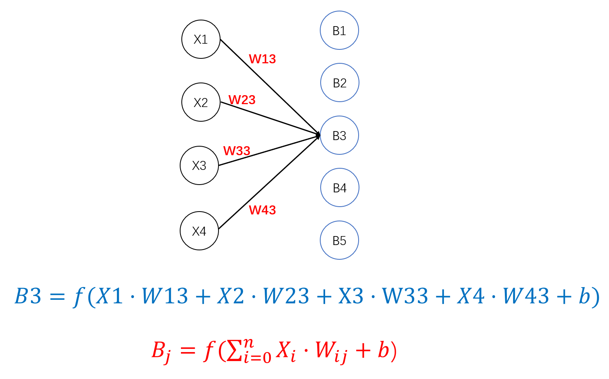

我们会发现，在f有一个偏置bias。这一个值意味着在达到一定的值时，神经元才会发送正激活。可以用另一种方式理解：

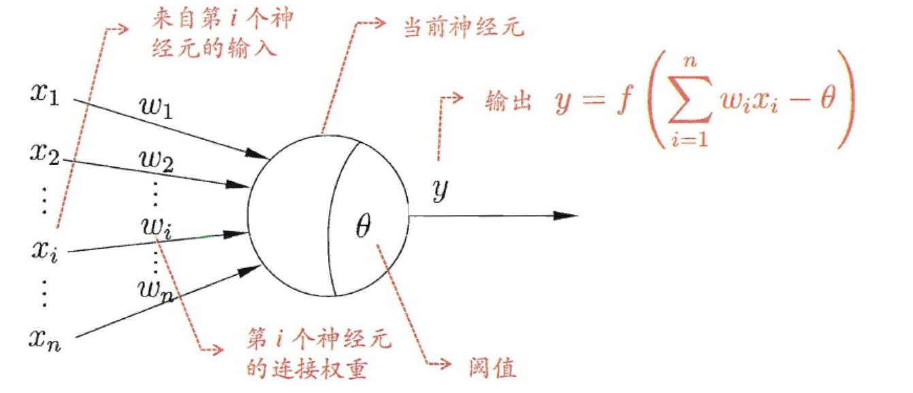

只有当SUM值>θ，才会发生正激活，而神经元最终的值取决于激活函数的选择

其中,函数$f$是非线性的，称为激活函数。以下列出几个激活函数

* Sigmoid，将值压缩在[0,1]。其公式为$y=\frac{1}{1+e^-x}$

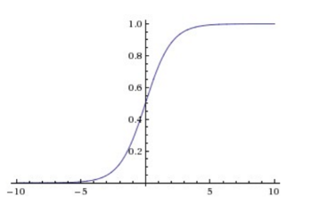

* ReLU：其阈值设置为0。其公式为$f(X)=max(0,x)$

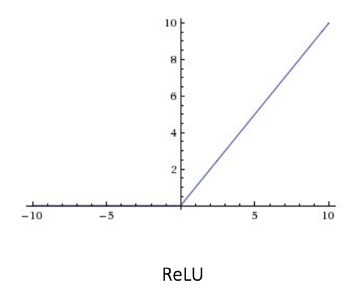

更多的激活函数查询./激活函数.md


# MLP-多层感知机

MLP包含一个输入层Input Layer、一个或多个隐藏层Hidden Layer、一个输出层Output Layer

输入层和输出层并不会用来计算，只有隐含场会进行计算。相邻两层的两个节点之间均存在权重$W_{ij}$


MLP需要通过训练或者学习来提高正确率，学习的过程也被称之为 **误差反向传播(Backward Propagation of Errors)**。它是一种监督训练的方案，也就是说它从训练集中已有标记的训练数据中学习，当MLP得到的结果与标记的数据不相同时，会得到纠正，从后往前调整权重。在MLP中，神经元的值会根据不同的输入而有不同的值，也就是说，**权重** 才是决定输出的关键

在输出的时，我们通常使用Softmax函数当作输出层的激活函数，以确保输出的是概率且和为1。Softmax会将实值向量压缩成介于[0,1]之间且总和为1的向量，即 通过的概率 + 未通过的概率 = 1


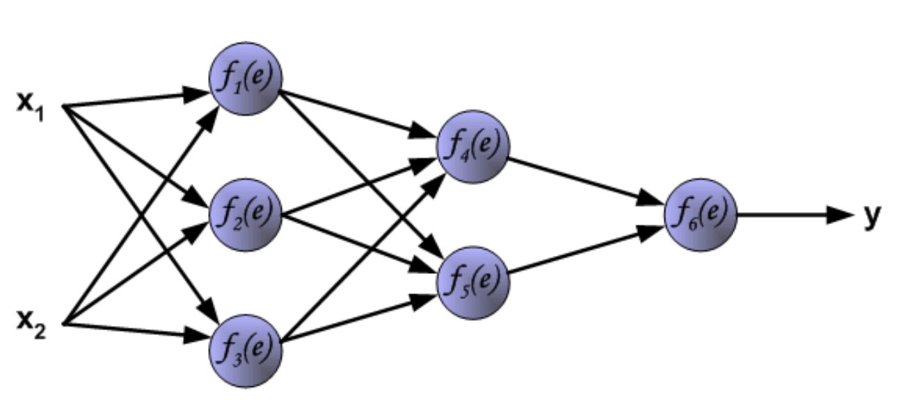

* 这是一个有3层隐含层的MLP

## 学习步骤

1.前向传播，它会将每一个神经元都重新计算，直到输出层，输出层的值即是预测值

2.反向传播与权重更新。参考：[Backpropagation (agh.edu.pl)](https://home.agh.edu.pl/~vlsi/AI/backp_t_en/backprop.html)


# CNN-卷积神经网络

卷积神经网络称之为ConvNets或CNN。

CNN有四个主要操作：

* 卷积 (Convolution)
* 非线性变化 (ReLU)
* 合并或下采样 (池化Pooling)

* 全连接层 (Fully Connected Layer / FC)

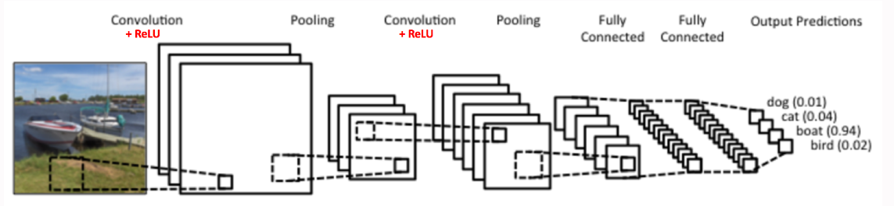

在CNN的输入中，我们常常会提到 **通道Channel** ,这用于指代图像的特定分量

一般而言，彩色图像拥有三个通道: R/G/B；而灰度图像只有一个通道


## CNN四个操作解析

### 卷积-Convolution

卷积的主要目的是提取图像特征

我们考虑一个5x5的图像矩阵，对于灰度图而言，矩阵的值应该在[0,255]，在这个例子中，为了方便理解和运算，仅仅有0/1

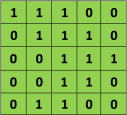

我们再**自定义**一个3x3的矩阵

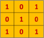

将两个矩阵进行卷积，得出一个3x3的卷积特征(Convolved Feature)。注意，卷积并非矩阵相乘，而仅仅是简单的对应元素相乘再相加

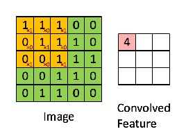

3x3的自定义矩阵也被称之为 **滤波器Filter** 或 **卷积核Kernel** 。得到的新矩阵被称之为卷积特征/激活图/特征图。对于不同的Filter或者Kernel，可以得到不同的结果，如边缘检测、锐化或者模糊

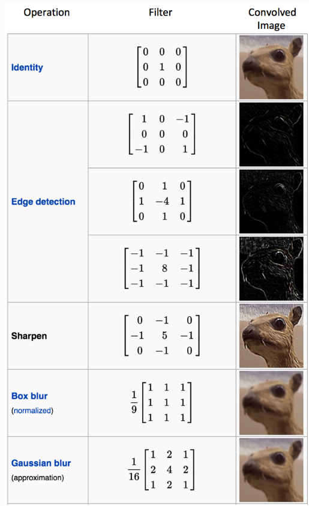

在下图中，红色边框与绿色边框是不同的Filter，可以看出得到的特征图是不相同的


特征图的大小由三个参数影响，这三个参数需要在卷积运算前确定：

* 深度Depth：深度对应我们用于卷积运算的Filter的数量。对于下图，我们使用了三个Filter，因此会产生三个不同的特征图，因此深度为3

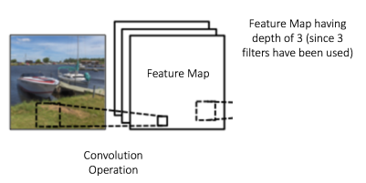

* 步幅Stride：步幅是Filter在输入矩阵中每次卷积运算后划过的像素数。如上图的5x5和3x3的卷积运算，其每次移动1个像素，因此步幅为1。步幅越大，卷积运算次数越少，因此特征图越小


* 零填充Padding：零填充可以用来控制特征图的大小，通过在输入矩阵的边界周围填充零，此时Filter可以对图像的边界进行卷积运算。对于使用零填充的卷积运算，称之为宽卷积；反之，称之为窄卷积

    * Padding=3表示在3x3的矩阵的上下左右更增添三条值为0的矩阵，其大小会变成9x9

    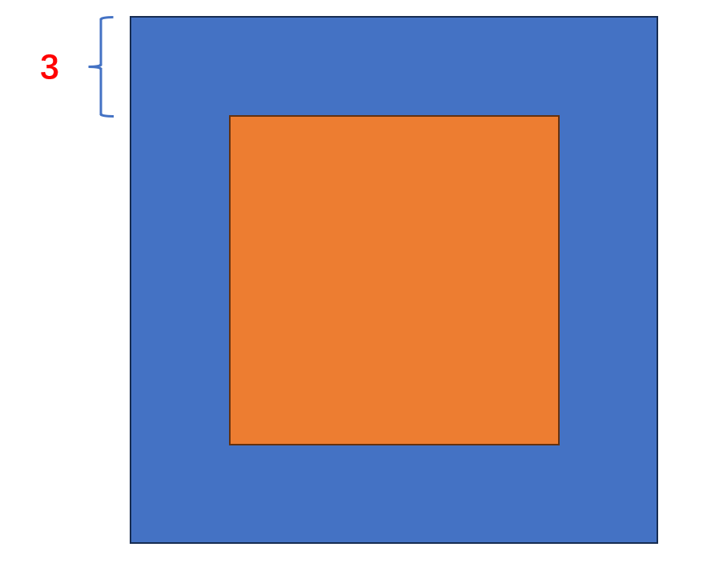


### 非线性操作

非线性函数常见的有ReLU、tanh、sigmoid，在这里使用ReLU

在进行卷积运算之后，会经过一个ReLU函数，ReLU的定义为$f(x)=max(0,x)$，目的是将所有负像素值替换为0。

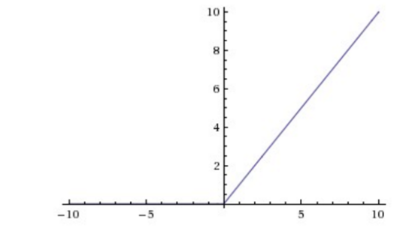

在以下的图像中，输入图像的黑色点表示负像素值，白色点表示正像素值。经过ReLU后，只存在非负像素值

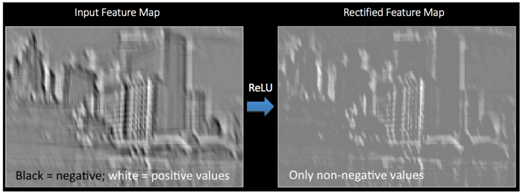

* 注意，虽然灰度值在[0,255]这个区间，但有时候会将其归一到[-1,1]进行后续操作。归一公式:$Result = \frac{2x}{255}-1$


### 合并/下采样/池化

它也可以被称之为 **下采样Downsampling** 或 **池化Pooling**，它用于降低每个特征图的维度，同时保留了重要的信息。

池化可以是不同的类型，如：选择最大值、平均值或总和。我们将选取最大值举例子

在最大池化的情况下，我们定义一个2x2的窗口(也被称之为空间领域Neighborhood)，并选取这个窗口的最大元素。注意，窗口的移动取决于步幅，在以下图示中，Stride=2，即每次移动滑动两个单元格

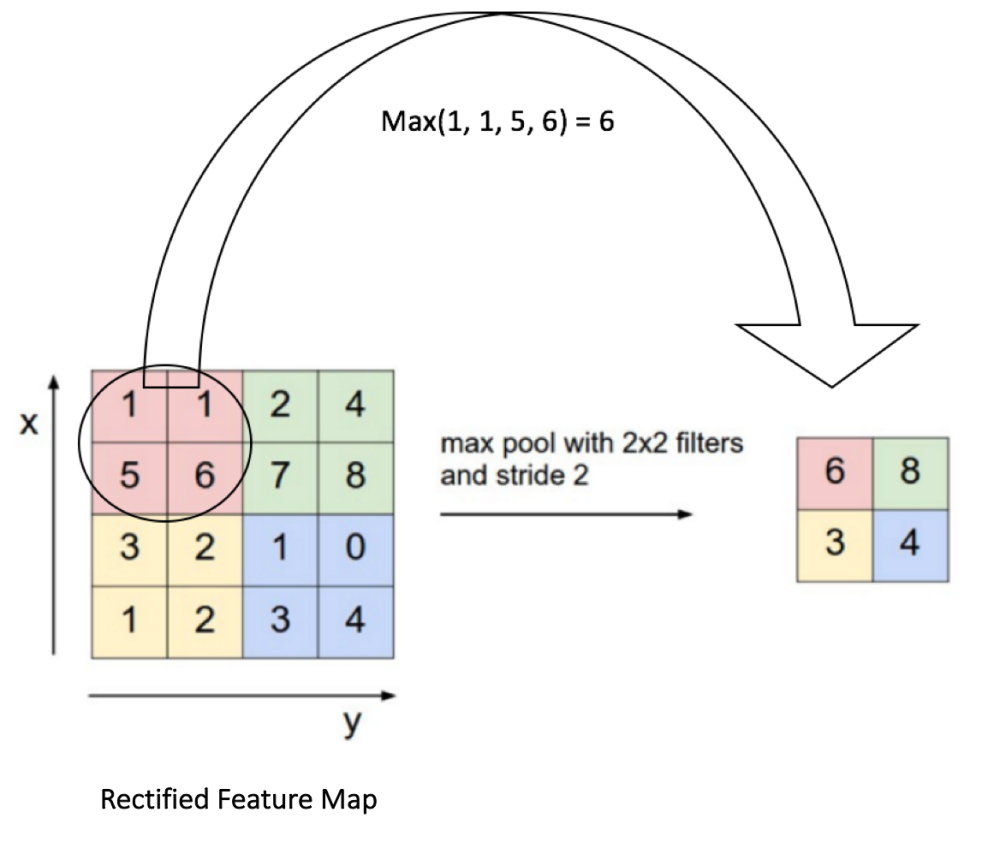

在之前，我们距离了如果Filter为3，它则会得到三个特征图。现在，池化操作将会对这三个特征图分别进行映射，得到三个降低了维度的新特征图

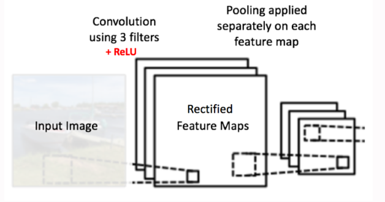

不同的池化操作会产生不同效果的特征图。我们选取经过ReLU取出negative像素值的特征图，对其分别进行最大池化和总和池化，会得到以下结果：


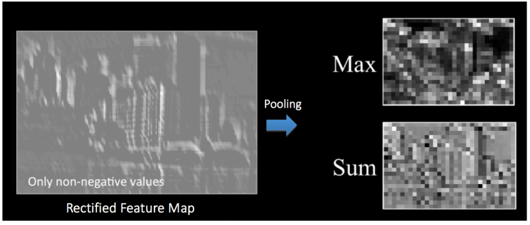

池化功能总述：

* 使输入的特征图维度更小，易于管理
* 减少网络中的参数和计算量
* 使网络对输入图像中的小变换、失真和平移保持不变
* 帮助我们得到图像的等变


在以下图片中，我们的操作步骤是：

* 对Input进行Conv，其中，Filter为3，同时对卷积运算进行ReLU
* 对三张特征图进行池化操作，得到新的三张特征图
* 对新的特征图再次进行Conv，其中，Filter为2，同时对卷积运算进行ReLU
* 再次进行池化操作

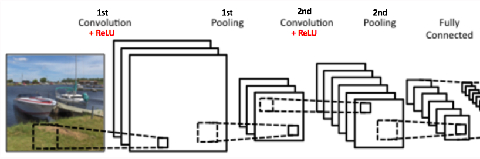

简单来说，卷积和池化的目的是提取输入图像的重要特征，并降低计算量


### 全连接层

全连接层实际上就一个传统的 **多层感知器MLP**，他在输出层使用Softmax激活函数，将值限制在[0,1]且和为1

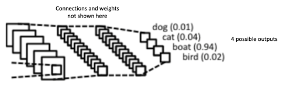


## 训练-反向传播

训练过程和MLP类似。在下图中，我们输入了一张图片，卷积层和池化层充当特征提取器，而全连接层充当分类器

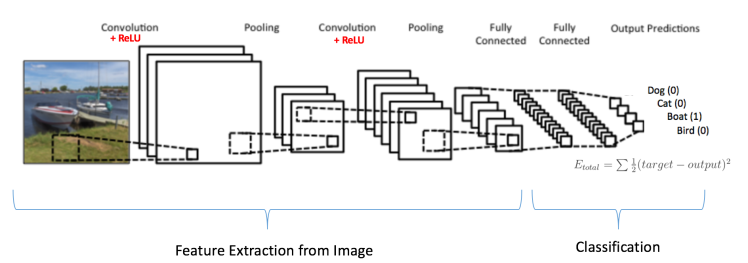

### 卷积网络的训练过程

1.使用随机值初始化所有的Filter和全连接层的权重

2.输入训练图像，经过前向传播步骤(Conv->Pooling->Conv->Pooling->FC)，得到一个结果向量

* 假设结果向量为[0.2 , 0.4 ,  0.1 , 0.3]，这是因为Filter和FC的参数是随机值，因此得到的结果也是随机的

3.计算输出层的总误差

4.使用反向传播计算关于网络中所有权重误差的梯度，并使用梯度下降更新所有的Filter和Weight

* 权重与他们对总误差的影响程度成比例调整
* 当再次输入相同的图像时，结果向量会接近正确的[0,0,1,0]
* 越接近，意味着网络已经学会了对该类别图像的分类


## 可视化操作

一般来说，卷积步骤越多，越能识别复杂的特征

例如，在图像分类中，ConvNet可以学习从第一层中的元素像素检测边缘，然后使用边缘检测第二层中的简单形状，最后可以识别到更高层的特征信息

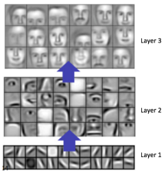

在数字识别中，我们输入了一个包含1024个像素的图像，第一个卷积层由6个Filter组成，产生深度为6的特征图；而对这六个特征图分别进行2x2的最大池化，进一步缩小维度且保留了重要特征....

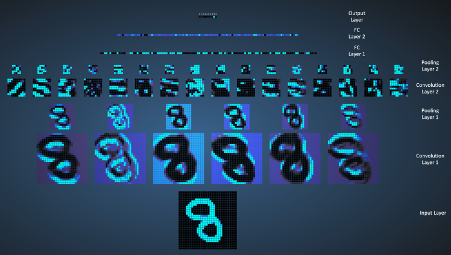

FC层：

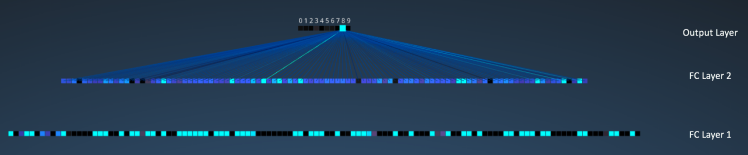


# Stacked Hourglass-堆叠沙漏网络

源码：[wbenbihi/hourglasstensorflow: Tensorflow implementation of Stacked Hourglass Networks for Human Pose Estimation (github.com)](https://github.com/wbenbihi/hourglasstensorflow)


### Stacked Hourglass Model

简称SHM，利用多尺度特征来识别姿态。在此之前大多数的姿态估计(Pose estimation)的网络架构中，大多只是用最后一层的卷积特征，这有可能会造成信息上的丢失。

在姿态估计这种关联性强的任务中，全身不同的关节点，在相同的特征图中不一定有最好的识别精度。比如，在一个人体输入中，头部可能在五层的特征图中容易识别，而胳膊在第三层更容易识别。而SHM就是为此而诞生，可以同时使用多个特征图的网络结构

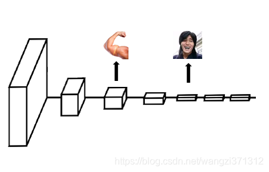


### Hourglass Network

单独的沙漏网络，堆叠沙漏网络就是将其组合起来


我们可以发现，C1~C7是一个Stacked Hourglass Model。其中，有两点不同：

* 右边部分(C4b~C1b)就像左边的镜像，倒序地复制了(C1~C4)。这看起来就像个沙漏
* 上面也复制了一份C4a~C1a，而且每个方块与右边对应的方块合并

下面将解析C4b的构成：

* C4b由C7和C4a组成
* C7先通过上采样Upsampling，相当于反向池化操作。在扩大之后，其卷积核也需要同步扩大，以防止识别到不同的特征
* C4a可以看作是C4的副本，且它的大小与上采样后的C7一样，将这两个矩阵的数值相加，即为C4b

伪代码：

```python
C7_up = upsampling(C7) # 将C7进行上采样，使其与C4a大小相同
C4a = residual(C4) # 对C4进行Residual处理，可以理解为复制了一份C4

C4b = C7_up + C4a
...
C3b = C4b + C3a
C2b = C3b + C2a
C1b = C2b + C1a
```

通过这样的层层叠加，最终的卷积特征C1b保留了所有层的信息，且与输入原图/第一层特征图的大小相等。

这意味着可以通过1x1的卷积核生成代表关键点概率的Heat Map


### Heat Map

在姿态估计的最后一步，便是对特征图Feature Map的每一个像素做概率预测，计算该像素是某个关节点的概率

在下图中，我们输入一个正在运动的人体，对其关节进行检测。

红色和黄色区域表示该像素位置是颈部的概率很高，而蓝色区域则表示该区域几乎不可能是颈部位置

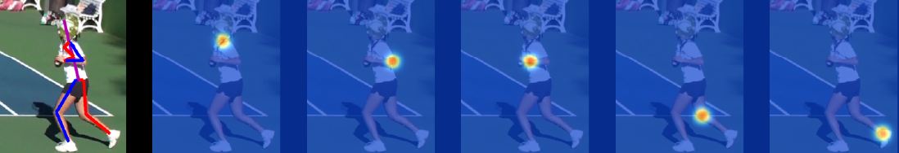

将有以下输出：
```python
# one_in_C1b和two_in_C1b为特征图上的两个像素点
# socre_of_xxx表示该点得分，得分越高，概率越高

[ one_in_C1b ] -> [socre_of_neck,score_of_wrist,socre_of_knee,... ]
[ one_in_C1b ] ->[socre_of_neck,score_of_wrist,socre_of_knee,... ]

```


### Stacked Hourglass Network

对于Houglass Network，其实已经可以应用于姿态估计。

但由于人的关节具备关联性，如双肩中间是颈部，有了腰部和脚裸的位置就可以用于预测膝盖...

既然Heat Map代表了输入对象的所有关节点，那么其本身就包含了所有关节点的相互关系。将第一个Hourglass Network的输出当作第二个Hourglass Network的输入，就意味着第二个网络可以使用关节点之间的相互关系，提升其预测精度

例如下图，N1表示第一个沙漏网络，在经过一系列的卷积网络之后，分成了上下两部分：

* 上部分继续经过1x1的卷积，与下部分合并
* 下部分先经过一次1x1的卷积，生成了Heat Map(蓝色部分)。而Heat Map可以看出较窄，这是因为Heat Map矩阵的Depth与训练数据里的节点数一致
* 因此，Heat Map要经过一次1x1的卷积网络，将其大小调整到与上部分一致，并最终与上部分合并，作为N2的输入


### Intermediate Supervision-中间监督

考虑网络中间部分的训练方式，称之为中间监督

在传统的神经网络中，Loss只比较最终输出与Ground Truth的差异，并反向传播调整参数。

而堆叠沙漏网络由多个沙漏网络组成，因此这种学习方式是较为不精准的。此时，每一个子沙漏网络都会有Heat Map作为预测，并将其参与到Loss中。